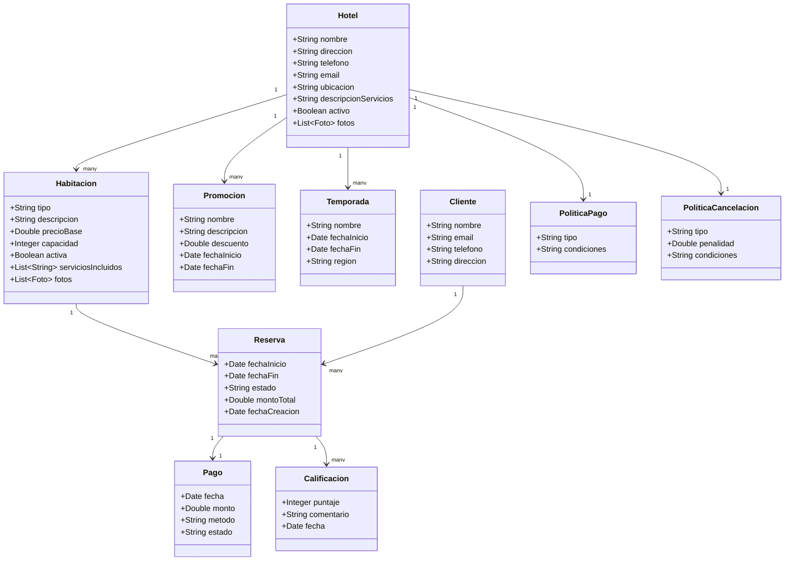

## 📌 Entidades identificadas

1. **Hotel**

   * nombre
   * dirección
   * teléfono
   * correo electrónico
   * ubicación geográfica
   * descripción servicios
   * estado (activo/inactivo)
   * fotos
   * promociones

2. **Habitación**

   * tipo
   * descripción
   * precio base
   * capacidad
   * estado (activa/inactiva)
   * servicios incluidos
   * fotos
   * calendario disponibilidad

3. **Promoción / Oferta**

   * nombre
   * descripción
   * descuento (%)
   * fecha inicio – fecha fin
   * condiciones

4. **Temporada**

   * nombre (alta, baja, etc.)
   * fecha inicio – fecha fin
   * región asociada

5. **Cliente**

   * nombre completo
   * correo electrónico
   * teléfono
   * dirección

6. **Reserva**

   * fecha inicio – fecha fin
   * estado (pendiente, confirmada, cancelada)
   * monto total
   * fecha creación

7. **Política de Pago**

   * tipo (anticipado, check-in, etc.)
   * condiciones

8. **Política de Cancelación**

   * tipo (reembolsable, parcial, no reembolsable)
   * penalidad (%)
   * condiciones

9. **Pago**

   * fecha
   * monto
   * método (tarjeta, PayPal, etc.)
   * estado

10. **Calificación / Comentario**

    * puntaje (1–5)
    * comentario
    * fecha

---

## 📐 Diagrama de Clases (Mermaid UML)

